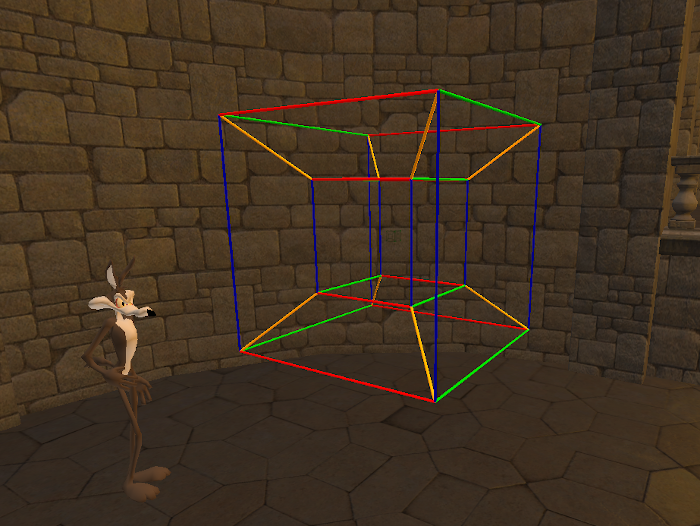
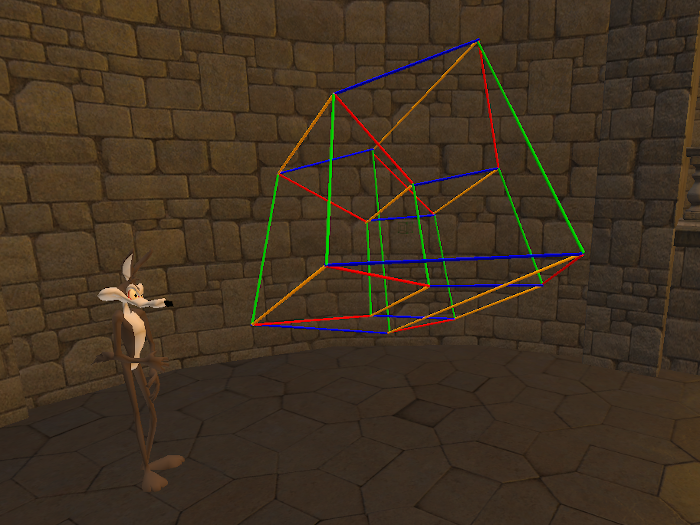
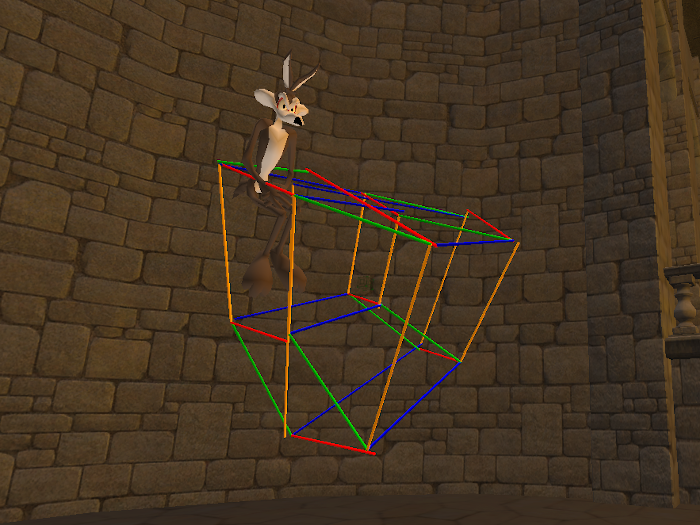
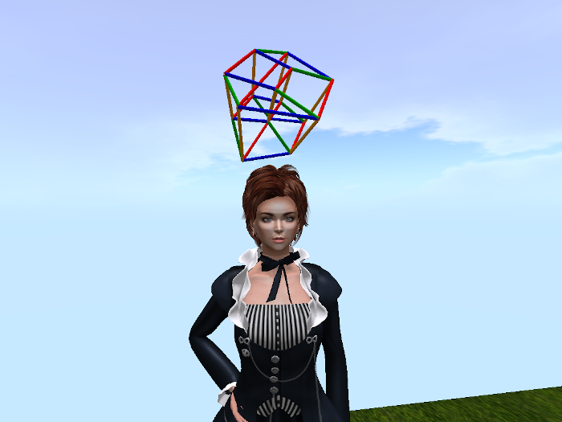

# Fourmilab Tesseract

[Fourmilab Tesseract](https://marketplace.secondlife.com/p/Fourmilab-Tesseract/23903981)
displays four-dimensional objects in the the Second Life virtual world.
It projects four-dimensional wire frame models into the three
dimensional world, allowing rotation around all planes to illustrate
the structure of the object.

This repository contains all of the software and resources, including
programs in Linden Scripting Language, textures, notecards, and
development documentation, tools, and resources used in the model and
its development.  The actual model is built within Second Life and
these components are installed within it.

The
[complete package](https://marketplace.secondlife.com/p/Fourmilab-Tesseract/23903981)
is available for free in the Second Life Marketplace.  This repository
contains everything in the model (except the prims, which are objects
built within Second Life), plus additional resources for developers who
may wish to extend or adapt the model as they wish.  The model is
delivered with "full permissions": those who obtain it are free to
copy, modify, and transfer it to other users within Second Life.

A [video demonstration](https://www.youtube.com/watch?v=MrK-Kz8HpJg)
is available on YouTube.

All of this software is licensed under the Creative Commons
Attribution-ShareAlike license.  Please see
[LICENSE.md](LICENSE.md) in this repository for details.

Please see the
[Fourmilab Tesseract User Guide](notecards/tesseract_user_guide.nc)
for details.
